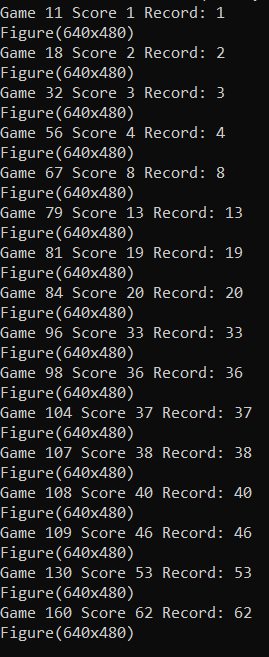
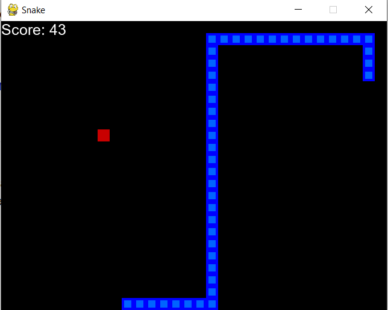
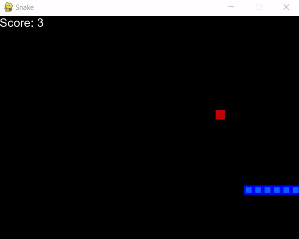
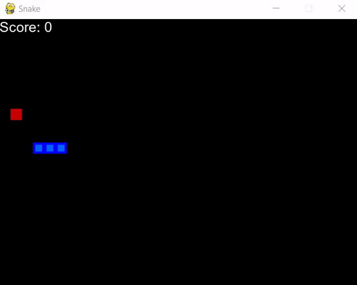

# Training an AI to play the Snake Game
- Uses reinforcement learning to train a neural network using PyTorch
- With more and more games, the AI learns to play the game and achieve a higher score  
  
  
## A game after about 30 rounds:
  
## A game after about 80 rounds:

